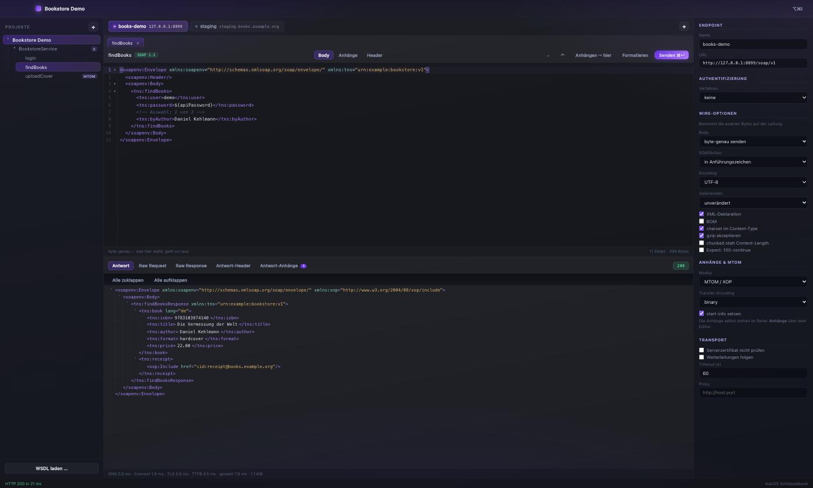
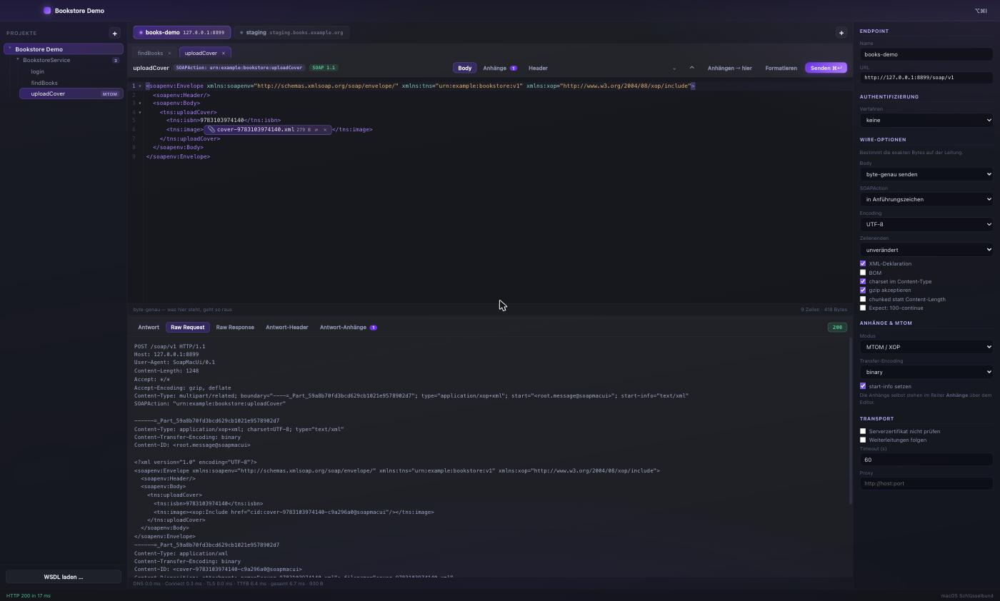
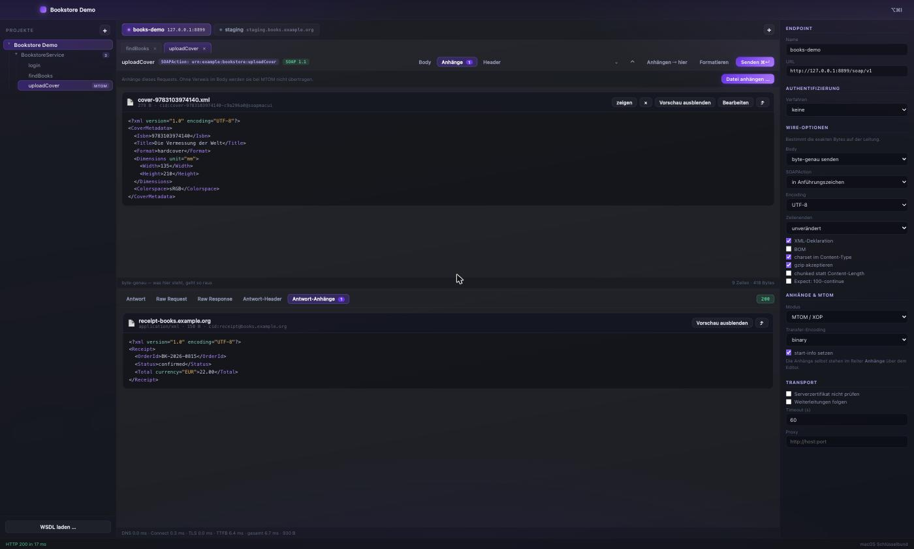

# SoapMacUi

SOAP-Schnittstellen testen. Nativ auf Apple Silicon, ein Binary, keine Runtime-Abhängigkeiten.
Ersatz für SoapUI (Intel-only, EOL auf Apple Silicon).

Der Entwurf mit allen Entscheidungen steht in [PLAN.md](PLAN.md).

Links der Projektbaum mit den aus dem WSDL erkannten Operationen, oben die
Endpoint-Tabs, in der Mitte der erzeugte Request und darunter die Antwort als
klappbarer Baum. Rechts die Wire-Optionen, die die exakten Bytes bestimmen.

Der Anhang erscheint im Editor als Datei-Chip — im Dokument steht weiterhin
wörtlich `<xop:Include href="cid:…"/>`, ersetzt wird nur die Darstellung.
Darunter der Mitschnitt dessen, was tatsächlich über die Leitung ging:
`multipart/related`, Content-IDs, SOAPAction, alles im Original.

Anhänge von Request und Antwort mit Vorschau; die des Requests lassen sich
direkt bearbeiten oder im externen Editor öffnen.

## Bauen und starten

Voraussetzungen: Go, Node (für den Frontend-Build) und die Wails-CLI
(`go install github.com/wailsapp/wails/v2/cmd/wails@latest`). Node wird nur auf
der Build-Maschine gebraucht — das ausgelieferte Binary bleibt eine Datei ohne
Laufzeitabhängigkeiten.

    make build     # Release-Build für Apple Silicon
    make sign      # zusätzlich signieren mit Hardened Runtime
    make run       # bauen und starten
    make dev       # Entwicklungsmodus: kein Signieren, Hot Reload, Devtools
    make test      # Tests, inklusive der echten Kunden-WSDLs

Ergebnis: `build/bin/SoapMacUi.app`, rund 9 MB.

### Ohne Signatur starten

Keiner der folgenden Wege benutzt ein Entwicklerzertifikat — Wails signiert nur
ad-hoc, damit macOS die App überhaupt startet.

    make dev    # natives Fenster, Hot Reload, Rechtsklick-Devtools
    make run    # unsigniert bauen und starten
    make bin    # dasselbe, aber im Terminal, damit Logs sichtbar bleiben

`make sign` ist der einzige Schritt, der deine Identität verwendet, und wird
nur für die Weitergabe an andere gebraucht.

`go run .` funktioniert **nicht**: Wails braucht seinen eigenen Build-Ablauf
(Build-Tags plus Frameworks), sonst bricht der Linker ab.

### Entwicklungsmodus

`make dev` (bzw. `wails dev`) baut ohne Signierung, startet die App und lädt
Änderungen an `frontend/` sofort nach — Go-Änderungen lösen einen Neubau aus.
Rechtsklick im Fenster öffnet die Devtools.

Zusätzlich läuft die Oberfläche unter **http://localhost:34115** im Browser,
inklusive der gebundenen Go-Methoden. Praktisch zum Debuggen; nur die nativen
Dateidialoge (Anhänge) funktionieren dort nicht.

## Erster Durchlauf

1. **Projekt anlegen** — Seitenleiste, `+`. Landet unter
   `~/Library/Application Support/SoapMacUi/Projects/<name>/`.
2. **WSDL laden** — die Adresse eingeben, z. B.
   `https://example.org/service.php?wsdl`.
   Bei Testzertifikaten den Haken „Serverzertifikat nicht prüfen" setzen.
   Endpoints, Services und Operationen werden automatisch erkannt, `xsd:import`
   und `xsd:include` rekursiv aufgelöst und im Projektordner zwischengespeichert.
3. **Operation anklicken** — der Beispiel-Request ist bereits erzeugt, mit
   `?`-Platzhaltern und der vollständigen Struktur aus dem XSD.
4. **Werte eintragen**, `⌘S` speichert byte-genau.
5. **Endpoint-Tab wählen** — der Wechsel richtet den *aktuellen* Request um.
   Body, Header, Anhänge und Auth bleiben stehen.
6. **`⌘↵` senden.** Unten stehen Antwort, Raw Request, Raw Response, Header
   und Anhänge; in der Fusszeile Timings und die TLS-Verbindung.

## Was drin ist

**WSDL/XSD** — WSDL 1.1, SOAP 1.1 und 1.2, document/literal und rpc/literal.
Vollständige Sample-Generierung aus dem Schema: `sequence`/`choice`/`all`,
Ableitung per `extension`/`restriction`, Arrays, Enumerationen (dort gewinnt ein
gültiger Wert gegen den Platzhalter), abstrakte Typen mit `xsi:type`,
Substitutionsgruppen, Rekursionsschutz. Präfixe werden aus dem WSDL übernommen.

**Wire-Exaktheit** — pro Endpoint einstellbar: byte-genau senden (Standard),
Whitespace zwischen Tags entfernen oder neu formatieren; XML-Deklaration, BOM,
Encoding (UTF-8/ISO-8859-1 mit Fehlermeldung statt stiller Ersetzung),
Zeilenenden, SOAPAction quoted/unquoted/weggelassen, charset im Content-Type,
gzip, chunked, `Expect: 100-continue`. Header gehen in Originalschreibweise raus
— `SOAPAction` bleibt `SOAPAction` und wird nicht zu `Soapaction`.

**Raw-Wire** — der Mitschnitt sitzt unterhalb von net/http und oberhalb von TLS.
Was dort steht, hat der Server exakt so gesehen, inklusive der Kopfzeilen, die
net/http selbst ergänzt.

**MTOM** — XOP mit `multipart/related`, klassisches SwA und inline base64,
umschaltbar. Content-ID-Format, Transfer-Encoding, Boundary und `start-info`
einstellbar. Eingehende Anhänge werden zerlegt und direkt auf die Platte
geschrieben. Anhänge werden gestreamt, nie komplett in den Speicher geholt.

**Auth** — HTTP Basic und WS-Security UsernameToken (PasswordText und
PasswordDigest mit Nonce und Created, Timestamp, `mustUnderstand`).
Passwörter liegen im macOS-Schlüsselbund; die Projektdatei hält nur einen
Referenzschlüssel.

**Editor** — CodeMirror 6 mit XML-Syntax, Klappen je Element, Suchen und
Ersetzen, Klammer-Matching und richtigem Undo. Das Dokument wird nicht
normalisiert: was im Editor steht, geht byte-genau raus.

**Tabs** — Request-Tabs mit eigener Kennung und eigenem Endpoint. Derselbe
Request lässt sich mehrfach öffnen und gegen verschiedene Systeme fahren; das
Kontextmenü listet alle offenen Requests.

**Persistenz** — eine Datei pro Request, der Body als eigene `.xml` daneben.
Diffbar, mergebar, ins Kunden-Repo legbar. Optionen werden vollständig und
explizit geschrieben, auch bei Default-Werten: ein Projekt von vor sechs Monaten
sendet dieselben Bytes.

**Reindex** — dieselbe WSDL-Adresse erneut laden diff gegen den gespeicherten
Stand. Neue, entfallene und geänderte Operationen werden gemeldet; bestehende
Requests bleiben unangetastet.

## Was noch fehlt

- **Verlauf in SQLite** (Abschnitt 2.10 des Plans) — geplant, noch nicht gebaut.
- **JS-Script-Hooks** über goja (P5) — die Ansatzpunkte stehen im Modell
  (`preScript`/`postScript` je Request), die Engine fehlt.
- **mTLS mit PKCS#12** — die Optionen sind im Modell, die Zertifikatsladung fehlt.
- **„An alle Endpoints senden" mit Response-Diff** — Backend (`SendToAll`) ist da,
  die Oberfläche dazu fehlt.
- **Windows-Build** ist vorbereitet, aber ungetestet; der Schlüsselbund fällt
  dort derzeit auf den Sitzungsspeicher zurück.

## Aufbau

`internal/` kennt Wails nicht — der gesamte Kern ist ohne Oberfläche testbar.

    xdom/      namespace-korrekter DOM (QNames in Attributwerten)
    ..
    frontend/src/    Quellen (index.html, style.css, app.js, editor.js)
    frontend/dist/   gebaute Assets — nur diese werden eingebettet
    xsd/       Schema-Modell und Sample-Generator
    wsdl/      WSDL 1.1, Import-Auflösung, flache Operationsliste
    soap/      Envelope-Bau, Wire-Optionen, MTOM, Antwort-Zerlegung
    httpx/     Transport, Raw-Mitschnitt, Timings, TLS
    auth/      Basic, WS-Security UsernameToken
    secrets/   Schlüsselbund-Abstraktion
    project/   Modell, Persistenz, Reindex
    app/       Wails-Brücke

## Veröffentlichen

`.github/workflows/ci.yml` läuft bei jedem Push: Formatierung, `go vet` und die
Tests auf Linux für den plattformunabhängigen Kern, dazu ein vollständiger
macOS-Lauf mit Race-Detektor, Frontend-Build und Universal Binary.

`.github/workflows/release.yml` löst bei einem Tag `v*` aus, baut ein Universal
Binary, signiert, notarisiert und hängt ein ZIP samt SHA-256 an das Release.
Ohne hinterlegte Zugangsdaten läuft der Build trotzdem durch — dann eben mit
ad-hoc-Signatur statt notarisiert.

Dafür nötige Repository-Secrets:

| Secret | Inhalt |
|---|---|
| `MACOS_CERT_P12` | „Developer ID Application"-Zertifikat als `.p12`, base64-kodiert |
| `MACOS_CERT_PASSWORD` | Passwort des `.p12` |
| `MACOS_SIGN_IDENTITY` | z. B. `Developer ID Application: Name (TEAMID)` |
| `APPLE_ID` | Apple-ID für die Notarisierung |
| `APPLE_TEAM_ID` | Team-ID |
| `APPLE_APP_PASSWORD` | app-spezifisches Passwort (nicht das Apple-ID-Passwort) |

Die Secrets legt ein Skript an — es zeigt keine Geheimnisse an und schiebt
das Zertifikat über eine Pipe direkt zu `gh`:

    ./scripts/setup-release-secrets.sh <owner>/<repo>

Fehlt noch ein „Developer ID Application"-Zertifikat (ein „Apple Development"
genügt **nicht**), führt dieser Weg dorthin:

    ./scripts/make-csr.sh                       # CSR erzeugen
    # developerid.csr auf developer.apple.com hochladen,
    # Profile Type: G2 Sub-CA. Zertifikat herunterladen, dann:
    ./scripts/import-developer-id.sh ~/Downloads/developerID_application.cer

Release auslösen:

    git tag v0.1.0 && git push origin v0.1.0

Bewusst **kein** Mac App Store: der erzwingt Sandboxing, was schlecht zu einem
Werkzeug passt, das beliebige interne Hosts erreichen und fremde Dateien lesen
und schreiben muss — und jedes Update ginge durch ein Review.

## Lizenz

Apache License 2.0 — siehe [LICENSE](LICENSE) und [NOTICE](NOTICE).

Kurz: Nutzung, Veränderung und Weitergabe sind frei, auch kommerziell.
Bedingungen sind die Nennung der Urheber (Copyright-Vermerk, Lizenztext und
NOTICE mitgeben) und ein Hinweis auf geänderte Dateien. Dazu kommt eine
ausdrückliche Patentlizenz der Beitragenden — der praktische Unterschied zu
MIT, und der Grund, warum Unternehmen mit Apache-2.0 leichter tun.

## Testdaten

`testdata/` enthält ausschliesslich erfundene Beispieldienste. WSDLs aus echten
Zielsystemen gehören nicht ins Repository — sie enthalten in aller Regel
interne Hostnamen und fremde Schnittstellenspezifikationen. Lege sie unter
`testdata-local/` ab, das ist per `.gitignore` ausgenommen.
